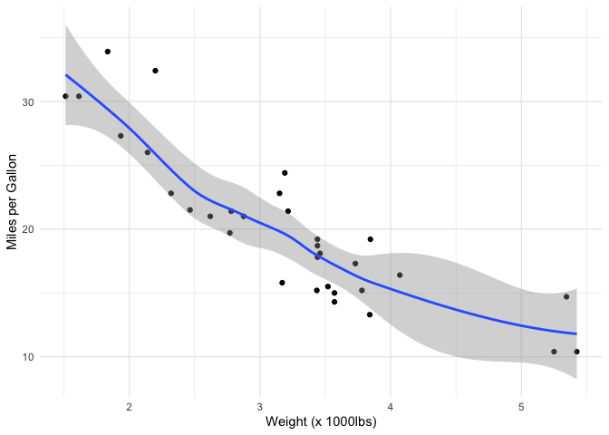

This page serves to document the code associated with your paper. I'd recommend not to copy-paste the code from your scripts verbatim in here, but instead to use this page to document the organization of the different scripts.

For instance, here's an R script that does some stuff: [here's an R script](/files/scripts/example_r.R)

And for good measure, here's a Python script: [here's a Python script](/files/scripts/example_python.py)

I recommend that you use simple markdown to write this document. It is the simplest and most consistent way. Add your scripts to the `/site/files/scripts/` folder in the website root directory. Link the scripts with the code above and add a description to inform the reader about the purpose of each script. Obviously, it's still important to have well-commented code within your scripts, but this script serves to guide the reader through the pipeline, and to document how the scripts link together.

Because I know this functionality will be appreciated by some, I also added the possibility to knit Rmarkdown documents to markdown (see the `code.Rmd` file in the `/site/` directory). It is important to note that if you are writing this documentation in Rmarkdown and knitting to markdown, then you need to prepend the site baseurl `{{ site.baseurl }}` to all figure links in the `.md` document after knitting. I haven't found a way yet to do this automatically when knitting from R. You can go into any text editor you use to edit the other `.md` files. Example will follow later.

Now let's see what we can do when we knit in Rmarkdown. Here's some code loading a package:

```{r load-packages}
library(tidyverse)
```

And here's a random plot:

```{r example-plot, results='hide'}
ggplot(mtcars,aes(x=wt,y=mpg)) + 
  geom_point() +
  geom_smooth() +
  labs(x = "Weight (x 1000lbs)",
       y = "Miles per Gallon") +
  theme_minimal()
```

By default, plots don't show. The `.md` file will show something like this:

```{markdown orig-fig-path, eval=FALSE}



```

